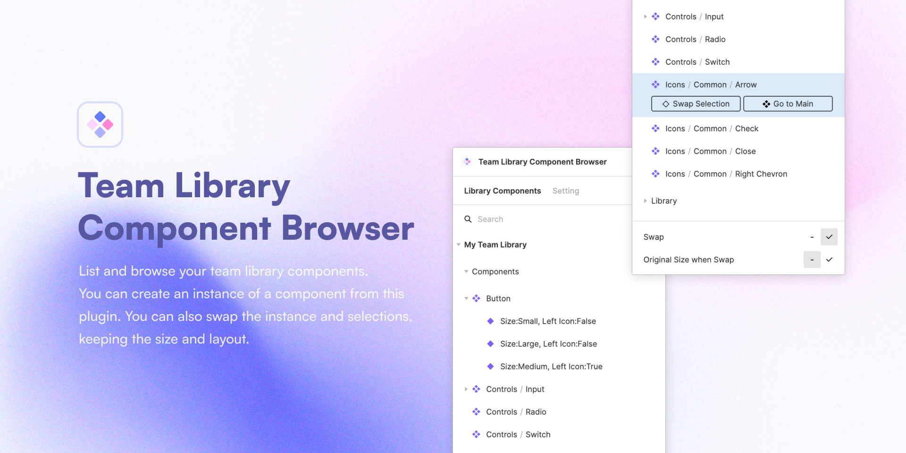

# Team Library Component Figma Plugin

List, browse, and create instance your team library components.

## 🔥 What you can:

- List and browse your team library components.
- Create instance of conponent from this plugin.
- Swap the instance and selection(s).
- Keep the size and layout of selection when you swap.

## 👉 How to use Team Library Component Browser:

1. Open this plugin in library what you want to list.
2. Go to Setting tab in this plugin.
3. Click ‘Save or update this library data’ button to save all components data in library to this plugin.
4. Go back to your document and open this plugin.
5. Enjoy!

## 🖌 Notes:

Because of the specifications of Figma's API, we can't get team library data automatically.  
So this plugin uses the figma.clientStorage API to store the library data on your machine.  
To store library data in clientStorage, you need to run this plugin in your library.

## 📮 Support:

If you have any plobrem or feedback, please use the GitHub Issues.
https://github.com/ryonakae/figma-plugin-team-library-component-browser/issues

---

This plugin is made by Ryo Nakae 🙎‍♂️.

- https://brdr.jp
- https://twitter.com/ryo_dg
- https://github.com/ryonakae
